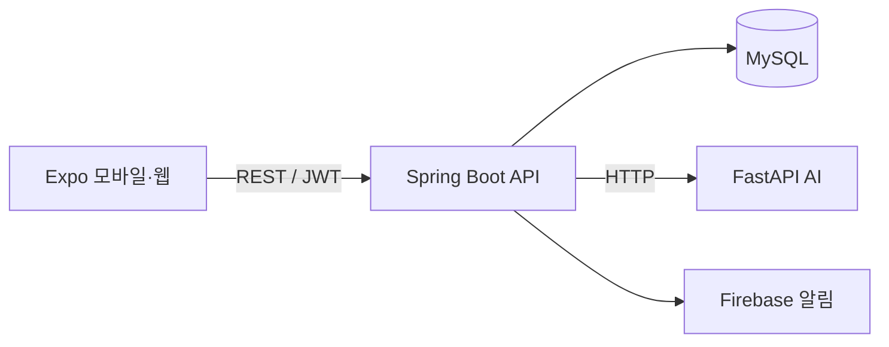

# 다잇미 (DietMe) Backend

개인 건강 정보와 식단·운동·체중 기록을 관리하고, AI 서버와 모바일 클라이언트를 연결하는 DietMe의 Spring Boot 백엔드입니다.

## 프로젝트 소개

다잇미는 사용자의 신체 정보와 목표를 기반으로 맞춤 건강 플랜을 제공하고, 매일의 식단·운동·체중 기록을 한곳에서 관리할 수 있는 건강관리 서비스입니다.

## 담당 범위

- Spring Boot 기반 인증·사용자·식단·운동·체중·알림 API 구현
- 카카오·구글 로그인과 JWT 인증 흐름 구현
- 건강 정보 온보딩, 목표 관리 및 홈 대시보드 API 개발
- 식단 이미지 업로드와 사용자별 기록 관리 구현
- 다이어트 그룹 식단 기록과 WebSocket 기반 실시간 채팅 개발
- MySQL 데이터 모델링, 요청 검증, 예외 처리 및 백엔드 테스트

## 팀 협업 범위

- 모바일 클라이언트 개발: 팀원 담당
- FastAPI AI 서비스 및 Spring Boot AI 연동 계층: 팀원 담당

## 시스템 구성



## 기술 스택

| 구분 | 기술 |
| --- | --- |
| Language | Java |
| Framework | Spring Boot, Spring Security, Spring Data JPA |
| Database | MySQL |
| Authentication | JWT, OAuth 연동 구조 |
| API 문서 | Springdoc OpenAPI / Swagger |
| 실시간 기능 | WebSocket / STOMP |
| 외부 연동 | FastAPI AI 서버, Firebase Admin SDK |
| Build | Maven Wrapper |

## 주요 API

| 영역 | 경로 예시 | 설명 |
| --- | --- | --- |
| 인증 | `/api/auth/signup`, `/api/auth/login` | 회원가입 및 로그인 |
| 사용자 | `/api/users/me` | 내 정보 조회 |
| 온보딩 | `/api/users/onboarding` | 건강 정보와 목표 등록 |
| AI 플랜 | `/api/ai/plans/initial` | 초기 맞춤 플랜 생성 |
| AI 점검 | `/api/ai/plans/reviews` | 최근 건강 기록 재분석 |
| 식단 AI | `/api/ai/meals/{id}/feedback` | 저장된 식단 기반 조언 |
| AI 채팅 | `/api/ai/coach/chat` | 사용자 기록 기반 질의응답 |
| 상태 확인 | `/api/health` | 서버 상태 확인 |

> 실제 경로와 요청 형식은 실행 환경의 Swagger 문서를 기준으로 확인합니다.

## 핵심 구현 내용

### 1. 인증과 접근 제어

- 비밀번호 기반 회원가입·로그인
- Access Token과 Refresh Token 분리
- 인증이 필요 없는 경로와 보호 API 분리
- 토큰 만료 시 모바일 클라이언트의 갱신·재요청 흐름 지원

### 2. 건강 기록 통합

- 식단, 운동, 체중 데이터를 사용자별로 저장
- 오늘 기록을 홈 대시보드 응답으로 통합
- 목표 체중 변경과 최신 체중을 즉시 반영

### 3. AI 서버 브리지

- 사용자 프로필과 최근 기록을 FastAPI 요청 형식으로 변환
- AI 초기 플랜과 재분석 결과를 DB에 저장
- AI 서버 장애를 백엔드 예외로 변환하여 클라이언트에 전달
- 최근 14일 식단·운동·체중 기록을 일별 데이터로 조립

## 로컬 실행

### 필요 환경

- Java
- MySQL
- 실행 중인 DietMe AI 서버

### 주요 환경변수

```text
DB_PASSWORD=
JWT_SECRET=
KAKAO_CLIENT_ID=
KAKAO_CLIENT_SECRET=
GOOGLE_CLIENT_ID=
FIREBASE_ENABLED=false
AI_SERVICE_BASE_URL=http://127.0.0.1:8000
```

### 실행 명령

```bash
./mvnw spring-boot:run
```

Windows:

```powershell
.\mvnw.cmd spring-boot:run
```

서버 확인:

```text
GET http://localhost:8080/api/health
```

## 연관 저장소

- Mobile: https://github.com/TANIT10/dietmall-mobile
- AI: https://github.com/TANIT10/dietmall-ai

## 테스트한 통합 흐름

회원가입 → 로그인 → 온보딩 → 체중·목표 설정 → 식단 기록 → AI 식단 조언 → AI 초기 플랜 → 최근 건강 기록 점검 → AI PT 채팅 흐름을 로컬 통합 환경에서 확인했습니다.

## 참고

이 서비스의 건강 플랜과 AI 조언은 건강관리 참고용이며 의료 진단이나 의료·영양 전문가의 처방을 대체하지 않습니다.
